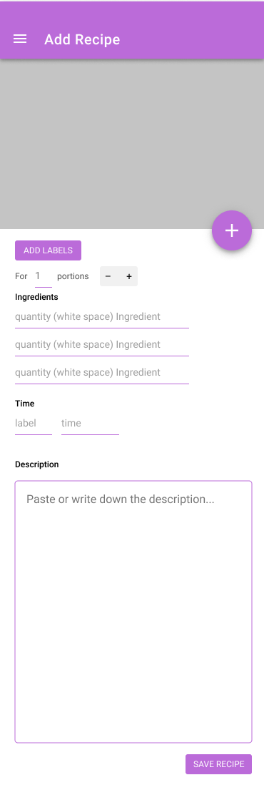

# All My Recipes
We often look for recipes on multiple websites. All My Recipes is an android app which allows the user to save favorite recipes in one place. The app makes it easier to export missing ingredients in a shopping list.

**Preview on some screens:**

## Demo
Here is a link to the prototype: https://bit.ly/3yxZ8qN

## Prerequisites
- An editor (e.g. Android Studio or IntelliJ)
- A (virtual) device for testing to Android app

## Getting Started
Select your target device and run `main.dart`.
